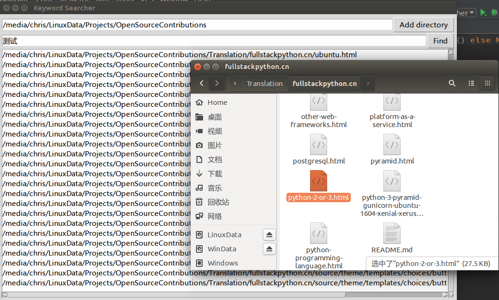

# Keyword Searcher
--------------------------

## Introduction
一个非常简单的 Python 小工具，我主要用它来快速查找指定目录及其子目录下所有的文件中是否有给定的关键词或者句子。如果匹配成功，则会将结果显示在列表框中，这个程序具有跨平台特性，所以也适合在 Windows　下用。写这个主要是为了学习 tkinter　布局和`os.walk`函数！

 
